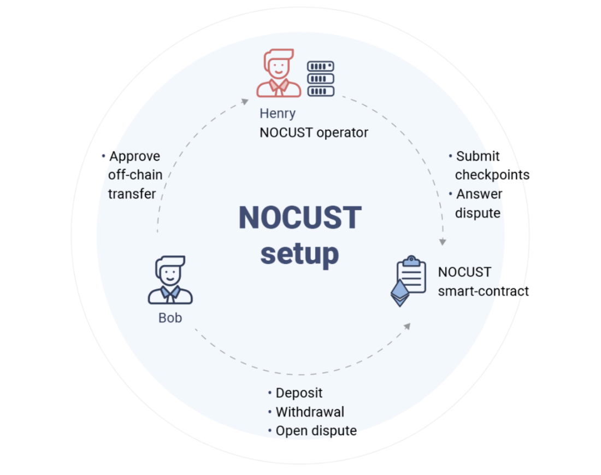

# Getting Started

Liquidity Network's underlying technology are NOCUST commit-chains, a layer 2 solution to scale blockchains such as Ethereum and it works today on the mainet!

A commit-chain is a *chain of commits* ⛓️, that means that NOCUST is committing regularly, every *round*, a commit of the commit-chain to the parent Ethereum chain. The commit-chain is run by a **non-custodial hub**, or operator, and clients communicate with the hub.

Contrary to side-chains, commit-chains don't need an additional consensus mechanism and rely on the security of Ethereum. We refer the interested developer to a basic introduction of NOCUST [here](https://blog.liquidity.network/2018/11/21/nocust-101/), we provide extensive details in our [background section](./background.md), and for the formal geeks we provide a [paper](https://eprint.iacr.org/2018/642.pdf) 🤓 .

For developers, we start by describing the JavaScript API for NOCUST 📱 (how to make transactions).

## NOCUST JavaScript API 📱

The `nocust-client` allows you to interact with the NOCUST 🌊 commit-chain.

In this document, we describe the client that allows developers to build wallets or dApps with *full commit-chain capabilities*. The client enables you to:

* Deposit (convert Ethereum ➡️ commit-chain coins)
* Withdraw (convert commit-chain coins ➡️ Ethereum)
* Make payments from address A ➡️ B
* Make atomic swaps between address A ↔️ B

The client currently supports Ether or ERC-20 tokens. Once Ether or tokens are on a commit-chain, we refer to them as fast, free (and furious?) assets, for example fETH, or fTOKEN. Transactions on the commit-chain **cost zero gas** and are **instant** enabling plenty new use-cases 😱. The client internally ensures the security of the commit-chain wallet by monitoring the smart-contract of the commit-chain operator (Henry) and the state of the commit-chain.

The following figure illustrates the diffrent roles of each component in a NOCUST commit-chain. Bob is the one running the NOCUST client to interact with Henry, the NOCUST operator and the smart contract.




## Installation

To install the NOCUST JavaScript API, simply run:

```text
npm install nocust-client
```

The client requires Web3 \(version 1.0.0-beta.36 only for now\) to interact with the Ethereum Network. Additionally, as we are manipulating exclusively Ether amounts in Wei \(10^-18 Ether\), we use the `bignumber.js` library for Ether and token amounts ([to go beyond the Javascript safe limit](https://stackoverflow.com/questions/307179/what-is-javascripts-highest-integer-value-that-a-number-can-go-to-without-losin)).

Required dependencies to be installed:

```text
npm install web3@1.0.0-beta.36 bignumber.js
```

For typescript users we recomment the following configuration in your `tsconfig.json` file.

```javascript
{
  "compilerOptions": {
    "baseUrl": ".",
    "paths": { "*": ["types/*"] },
    "target": "es6",
    "module": "commonjs",
    "outDir": "dist",
    "declaration": true,
    "sourceMap": true,
    "removeComments": true,
    "allowSyntheticDefaultImports": true,
    "esModuleInterop": true,
    "experimentalDecorators": true,
    "emitDecoratorMetadata": true,
    "typeRoots": [
      "node_modules/@types"
    ],
    "types": [
      "node"
   ],
  }
}
```

## Currently Deployed Commit-Chains

The following table shows a list of the currently deployed commit-chains.

| Ethereum Mainnet commit-chain |  |
| :--- | :--- |
| NOCUST smart-contract address \(`contractAddress`\) | To be deployed |
| Commit-Chain API URL \(`hubApiUrl`\) | [https://public.liquidity.network/](https://public.liquidity.network/) |
| LQD ERC-20 contract address | 0xD29F0b5b3F50b07Fe9a9511F7d86F4f4bAc3f8c4 |

| Rinkeby commit-chain | Value |
| :--- | :--- |
| NOCUST smart-contract address \(`contractAddress`\) | 0x6B9f10931E88349A572F2f0883E49528902B4b5D |
| Commit-Chain API URL \(`hubApiUrl`\) | [https://rinkeby.liquidity.network/](http://rinkeby.liquidity.network/) |
| Test ERC-20 contract address | 0xA9F86DD014C001Acd72d5b25831f94FaCfb48717 |

The following is a test commit-chain on a private blockchain with a shorter block interval \(4 seconds instead of 15 seconds\) and a shorter round time \(4 minutes instead of 36 hours\). This allows developers to test features much faster than waiting for long round times 😁.

Please do initiate Web3 with a HTTP provider given the RPC URL provided in the following table.

| Private test commit-chain |  |
| :--- | :--- |
| NOCUST smart-contract address \(`contractAddress`\) | 0x9561C133DD8580860B6b7E504bC5Aa500f0f06a7 |
| Commit-Chain API URL \(`hubApiUrl`\) | [https://limbo.liquidity.network/](https://limbo.liquidity.network/admission/) |
| Test ERC-20 contract address | 0xe982E462b094850F12AF94d21D470e21bE9D0E9C |
| Ethereum node RPC URL | [https://limbo.liquidity.network/ethrpc](https://limbo.liquidity.network/ethrpc) |


### Commit-Chain Transfer - Full Example

The following code sets up the client and transfers 0 fETH 🤪 from Bob 🙋‍♂️ to Alice 🙋‍♀️ (test using node).

```typescript
import web3 from 'Web3' // Web3 1.0.0-beta.36 only for now
import BigNumber from "bignumber.js"
import { LQDManager } from 'nocust-client'

const bob = '0xFFcf8FDEE72ac11b5c542428B35EEF5769C409f0';
const alice = '0x22d491Bde2303f2f43325b2108D26f1eAbA1e32b';

// We provide 2 private keys (do not do this in production..)
const bobPrivateKey = '0x6cbed15c793ce57650b9877cf6fa156fbef513c4e6134f022a85b1ffdd59b2a1'
const alicePrivateKey ='0x6370fd033278c143179d81c5526140625662b8daa446c22ee2d73db3707e620c'

// Setup web3 with Infura
const web3 = new Web3(new Web3.providers.HttpProvider('https://rinkeby.infura.io/'));
// Add the private keys to web3 for signing
web3.eth.accounts.wallet.add(bobPrivateKey)
web3.eth.accounts.wallet.add(alicePrivateKey)

// Specify to which commit-chain we want to connect
const lqdManager = new LQDManager({
  rpcApi: web3,
  hubApiUrl: 'https://rinkeby.liquidity.network/',
  contractAddress: '0x6B9f10931E88349A572F2f0883E49528902B4b5D',
  });

const sendToALice = async () => {
  // Register an address with the commit-chain
  await lqdManager.register(bob)
  await lqdManager.register(alice)

  // Send 0.00 fETH on the commit-chain to Alice  
  // In this example, we send 0 fETH, because Alice doesn't have any funds yet, and yes, we can send 0-value commit-chain transaction, haha
  const txId = await lqdManager.postTransfer({
      to: alice,
      // 0.00 fEther in Wei as BigNumber. 
      amount: (new BigNumber(0.00)).shiftedBy(-18),
      from: bob,
   });

  console.log("Transfer to Alice sent ! Transaction ID: ", txId)

}

sendToALice()

```


### Deposits (Ethereum ➡️ Commit-Chain)

In order to make transfers, you need to have commit-chain funds. Commit-chain funds are simply funds deposited into the NOCUST smart-contract, and can be done through the client as follows.

```typescript
const transactionHash : string = await lqdManager.deposit(
  bob,                             // Account from which to make a deposit (its private key needs to be in the Web3 instance)
  web3.utils.toWei(0.5,'ether'), // Amount to deposit
  web3.utils.toWei(10,'gwei'),   // Gas price, 10 Gwei
  150000                         // Gas Limit
);
```

The function `deposit()` makes a contract call to the NOCUST smart contract with the specified amount. The commit-chain funds are available after `60` block confirmation. To verify the commit-chain balance, you can call the `getOffChainBalance()` function. Note that `deposit()`and `getoffChainBalance()` take a parameter `tokenAddress` to similarly manipulate ERC-20 tokens.

```typescript
const balance : BigNumber = await lqdManager.getOffChainBalance(bob);
console.log("Bob's commit-chain balance is: ", balance.toString())
```

⚠️ Don't forget to provide a [transfer allowance](https://medium.com/ethex-market/erc20-approve-allow-explained-88d6de921ce9) to the NOCUST contract for the ERC-20 you wish to use.


### Commit-Chain Transfers (🙋‍♂️ ➡️ 🙋‍♀️)

Commit-Chain transfers are free of gas and instant! There are two modes to send them.

* **Active Delivery:** The NOCUST commit-chain currently requires the recipient of a transfer to be online (to sign a message to receive a commit-chain transfer). Once the library is setup and after calling the `register` function, transfers are automatically accepted.

* **Passive Delivery [soon]:** We will soon be releasing an upgrade to NOCUST to allow a client to receive a transaction while **offline** 👻.

#### Listening for Incoming Transfers

If you want to trigger a special event upon an incoming transaction, you can define the following catcher:

```typescript
import web3 from 'Web3' // Web3 1.0.x
import { LQDManager } from 'nocust-client'
const alice = '0x22d491Bde2303f2f43325b2108D26f1eAbA1e32b';
const alicePrivateKey = '0x6370fd033278c143179d81c5526140625662b8daa446c22ee2d73db3707e620c'

// Setup web3 with Infura
const web3 = new Web3(new Web3.providers.HttpProvider('https://mainnet.infura.io/'));
web3.eth.accounts.wallet.add(alicePrivateKey) // Add private to web3 for signing

// Setup the LQDManager
const lqdManager = new LQDManager({
  rpcApi: web3,
  hubApiUrl: 'https://rinkeby.liquidity.network/',
  contractAddress: '0x6B9f10931E88349A572F2f0883E49528902B4b5D',
});

function async register() {
  // Register an address to be used with the LQD manager
  const incomingTransferEventEmitter = await lqdManager.register(alice)

  // Trigger a log upon an incoming transfer
  incomingTransferEventEmitter.on('IncomingTransfer',
    (transfer: TransferDataInterface) => {
      console.log(`Alice is receiving a transfer of  ${transfer.amount} wei from ${transfer.wallet.address}`),
    });
  )

  console.log("Alice is ready to receive transfers !")
}
register()
```

#### ERC-20 Transfers

NOCUST 🌊 support the transfer of ERC-20 tokens. The operator, however, chooses which tokens can be used on the commit-chain. To see which tokens are currently supported by a commit-chain, call `getSupportedTokens()`:

```typescript
const supportedTokenArray : string[] = await lqdManager.getSupportedTokens()
const NocustContract : string = supportedTokenArray[0]
const tokenXYZcontract : string = supportedTokenArray[1]
```

`supportedTokenArray` contains an array of ERC-20 smart-contract addresses. The address at index 0 is the address of the NOCUST smart-contract (reflecting the fETH on the commit-chain).

With the help of the `register()` function, we can tell the operator which tokens we want to use:

```typescript
await lqdManager.register(bob, tokenXYZcontract)
// Bob can receive fETH and the fToken at the address `tokenXYZcontract`
```

The register function always registers fETH by default and registers the token(s) in the second parameter. Note, that the recipient also needs to `register()` the token. To make a fToken transfer, simply specify the address of the fToken in the `tokenAddress` field.

```typescript
  const txId : number = await lqdManager.sendTransfer({
      to: alice,
      amount: web3.utils.toWei(0.01,'ether'), // Amount
      from: bob,
      tokenAddress: tokenXYZ,
   });
```


### Withdrawals (Commit-Chain ➡️ Ethereum)

A withdrawal allows the user to send commit-chain funds back to Ethereum \(also called an exit\). Withdrawals take time ⌛ and are a 2 step process requiring 2 separate contract calls.

The amount of commit-chain funds available for withdrawal may differ from the current commit-chain balance. Recently acquired commit-chain funds cannot be withdrawn instantly, they will be made fully available over time. Recently acquired funds will need between 36h and 72h \(one full round\) to be available. To check the current balance available for withdrawal call the function `getWithdrawalLimit()` :

```typescript
const withdrawalLimit : BigNumber = lqdManager.getWithdrawalLimit(bob)
```

To initiate a withdrawal, call `withdrawalRequest()` with an amount <= `withdrawalLimit`:

```typescript
const transactionHash : string = await lqdManager.withdrawalRequest(
  bob,                           // Account from which to make the withdrawal
  web3.utils.toWei(0.5,'ether'), // Amount to withdraw
  web3.utils.toWei(10,'gwei'),   // Gas price, 10 Gwei
  300000                         // Gas Limit
);
```

This issues a contract call to initiate a withdrawal. After 36h to 72h \(corresponding to one full commit-chain round\), the withdrawal needs to be confirmed. To query how much time is left before the withdrawal can be confirmed you can call `getBlocksToWithdrawalConfirmation()`:

```typescript
const blocksToConfirmation : number = await lqdManager.getBlocksToWithdrawalConfirmation(bob)
```

 `getBlocksToWithdrawalConfirmation()` returns the number of block confirmations required before to confirm a withdrawal. If the function returns `0`, the withdrawal is ready for confirmation. Note that the function will return `-1` if there is no withdrawal pending.

Finally, to confirm the withdrawal, you can call `withdrawalConfirmation()`:

```typescript
const transactionHash : string = await lqdManager.withdrawalConfirmation(
  bob,                             // Account from which to make the withdrawal
  web3.utils.toWei(10,'gwei'),   // Gas price, 10 Gwei
  300000                         // Gas Limit
);
```

This contract call transfers the funds from the NOCUST smart contract to Bob's address.
