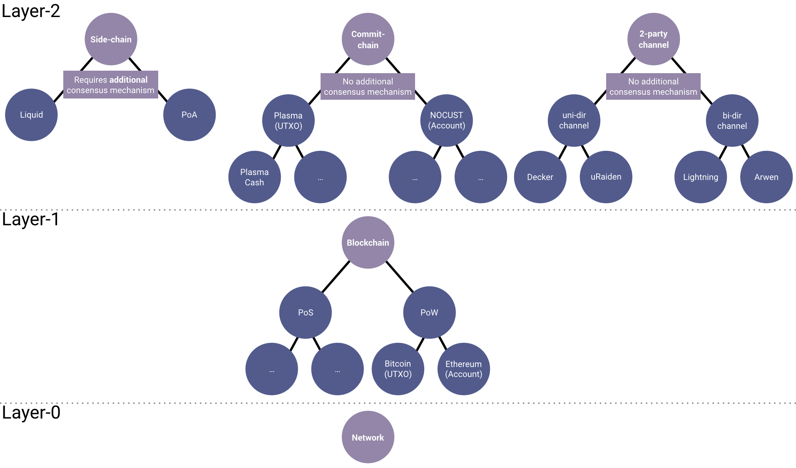
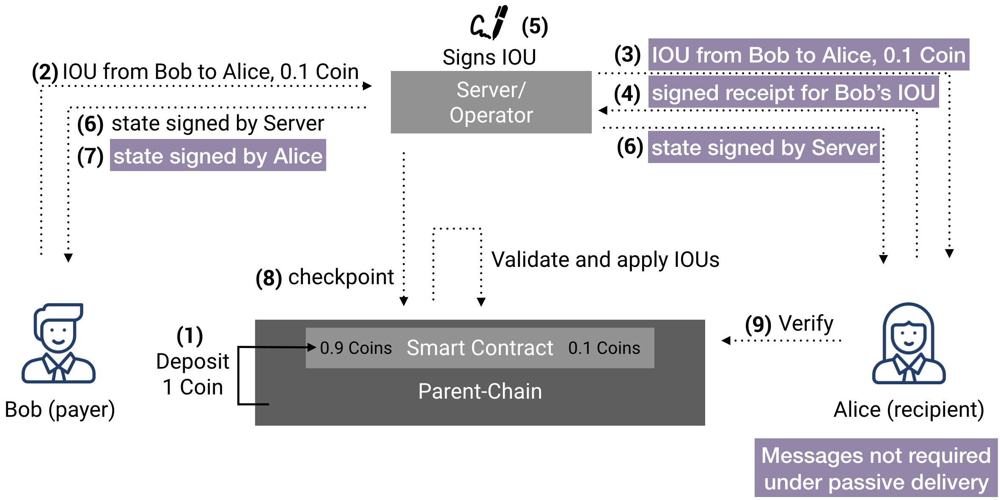
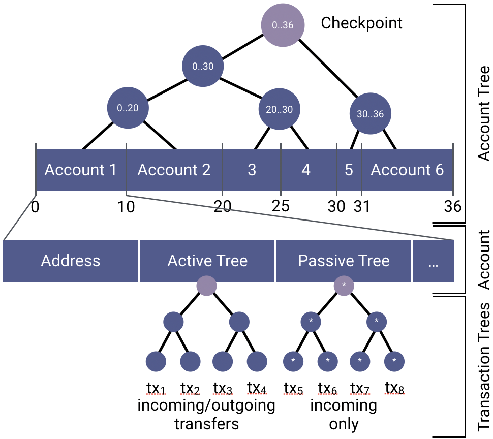

# NOCUST -  An overview 🧐

In this section the aim is to provide a good overview of what NOCUST and commit-chains are in general. For full nitty gritty details, we refer to our [paper](https://eprint.iacr.org/2018/642.pdf).

## Commit-Chains in the Layer 2 World

Like the name suggests, a commit-chain is a chain of commits. This means that commit-chains have to commit their latest state somewhere.. and this is on a parent-blockchain, such as Ethereum. If we look at different layer 2 scaling solutions, they could be classified according to the following taxonomy.

The important difference between commit- and side-chains is that commit-chains do not require an additional consensus mechanism (similar to payment channels). They rely on the security of their parent-chain. Contrary to payment channels, however, commit-chains have this concept of an **ongoing commit**, and therefore don't require expensive channel opening and closing phases, and can onboard billions of users at once.

## Trustless Centralized Intermediaries

A NOCUST commit chain operator is a centralized operator that coordinates and approves payments similar to a miner. The payment funds are moderated by the smart contract, which expects to periodically receive a checkpoint from the operator.

Due to the security checks by the smart contract and the observing users, the NOCUST operator cannot steal or misappropriate commit-chain funds. The NOCUST operator might become a single point of failure for availability, which however can be mitigated with a network of healthy commit-chains. Even if the NOCUST operator would disappear, users can always withdraw their funds using the smart contract and their latest confirmed balance. The operator moreover is not able to double-spend funds, even if all other users would collude with the operator.

## System Components

A commit-chain requires the following components:

- **Parent Blockchain ⛓️:** We assume the existence of a parent-ledger, an integrity protected and immutable root of trust (e.g. a blockchain), that allows for the convenient deployment of tamper-proof smart contracts and which acts as timestamping service. The ledger contains a global view of accounts, their balances and transactions, and extra associated data. Each account in the ledger is controlled by a private key, which authorizes transactions from the account.
- **User 🙋‍♀️:** A user owns at least one private key/account in the ledger and acts as recipient and payer of cryptocurrency assets on the parent-ledger and the commit-chain.
- **Commit-Chain Smart Contract 📝:** The smart contract acts as supervisor of the NOCUST operator and verifies its correct operation, accepts dispute initializations from users and halting the operator in case of misbehaviour.
- **Commit-Chain Operator 👨‍🎨:** The operator server mediates the communication between users, and is required to commit at regular time intervals a constant-sized checkpoint of all commit-chain accounts to the smart contract.

## High-Level Operations

We now outline the different high-level operations to bootstrap a commit-chain, register a user and perform *IOU* transfers over NOCUST.

NOCUST supports two modes of asset transfers, **active** and **passive delivery**. Under active delivery, the recipient is assumed to be online to sign a transaction receipt (a common assumption in payment channel networks). Under passive delivery, the receipt of a transaction is not sought, and the incoming transaction is communicated to the recipient at a later stage, either by the operator or out-of-band by the sender.

We outline in the following Figure the high-level operations, for both, active and passive delivery of commit-chain transactions. The payer (1) deposits assets from the parent- to the commit-chain and (2) authorizes a debit from its account towards the recipient. Under active delivery, the operator (3) notifies the recipient of the incoming transfer, the recipient (4) approves the state update to their account. The server (5) signs both updated states and (6) gives its respective signatures to both users. The NOCUST server (8) submits each round the aggregated commit-chain user balances to the \name smart contract. The users (9) observe the checkpoint submissions and verify *once* every round it's integrity (and potentially dispute).

## Bootstrapping a Commit-Chain

To bootstrap a commit-chain, we need to initialize the following components:

- **Operator Setup:** The operator deploys a smart contract on the parent-chain and initializes a *genesis* checkpoint.

- **User Registration:** Given its private key, a user signs a registration message and sends this message to the operator.

From now on, the operator keeps submitting each round a checkpoint that combines all commit-chain transactions.

## NOCUST Data Structure 👩‍🎨

The key novelty of NOCUST is its data structure. Commit-chain assets are managed within a Merkelized interval tree which separates individual user account balances in exclusive interval allotments. Each account occupies an exclusive and non-intersecting interval. The total amount of coins managed by NOCUST is the sum of all intervals.

The constant-sized root of this tree corresponds to the checkpoint, which is submitted together with the total amount of funds managed by the NOCUST operator. Every internal Merkle tree node is *annotated* with the continuous interval its two children occupy. This data structure allows for a straightforward verification that the sum of all accounts in the tree match the actual parent-chain balance of the smart contract. Therefore, double spends become obvious and fractional reserve scenarios are impossible.

We distinguish between the active and the passive tree to for respectively the active and passive delivery of transactions. The commit-chain in the following figure contains 36 coins, and 6 accounts.

## Security 🚨

We outline the overview of our security properties here, please consult our paper for proofs.

### Threat Model

We consider the adversary to control all network communication between users, and between the user and the commit-chain operator (Dolev-Yao model). Users, however, can always read and write to the parent-chain which is considered non-malicious (no ongoing 51% attack, active double-spending/selfish-mining attacks against the NOCUST smart contract). NOCUST tolerates a congested blockchain because the checkpoint submission is very cheap. We assume that a user is online at least once within a round, unless this service is outsourced to a watchtower.

### Challenges

To secure the correct operations, the NOCUST operator can be challenged with the following challenges.

- **Consistency/State Update Challenge:** Users monitor the checkpoint commitment, and each user only is preoccupied to verify their respective balance interval. Verification requires the partial Merkle tree of the Merkelized interval tree from the operator and to compare the state to the locally stored ratified state. Only the most recent checkpoint can be challenged.

  In case of misbehaviour, a user can issue a challenge using the NOCUST smart contract that requires the server to promptly answer this challenge with valid information.

- **Data Availability Challenge:** Users are assumed to come online once per round, and request their respective partial Merkle tree needed to withdraw assets from the commit-chain. If the operator is non-responsive, the user can challenge the operator through the parent-chain smart contract to provide the requested data.

To prevent griefing attacks from the users towards the operator, those challenges can be restricted to be only initiated by the owners of the account, or a set of explicitly whitelisted third parties such as watchtowers.

### Considered Adversaries 👹

- **Malicious payer:** A malicious user might attempt to sign two conflicting transactions, i.e. to spend more than the user would be eligible to. As the operator is benign and required to counter-sign each transfer, the user cannot misbehave without the operators' collusion.

- **Malicious payer colluding with the operator:** A malicious operator can collude with a user to try to double-spend assets: (1) by creating more commit-chain assets, i.e. by extending the Merkleized interval tree, or by (2) shrinking an allocated interval of a user.

  The smart contract rejects a checkpoint that accounts for more commit-chain assets than deposited in the contract. If the NOCUST operator incorrectly manipulates a user's account balance, the user will be able to detect and dispute this using the smart contract.

- **Malicious user attacking the operator:** A malicious user can open many accounts on the commit-chain and flood the operator with data availability challenges. To minimize the impact of this attack, the operator can (i) only allow a limited number of users to be able to dispute a particular account (e.g. the user and one watchtower), (ii) require human verification on account opening to limit the number of fraudulent accounts, and (iii) require the user to subsidize the response costs of a data availability challenge.

## Instant Transaction Finality ⌛

If the NOCUST operator chooses to disappear, or malfunctions prior to a checkpoint, not-yet included commit-chain transfers are lost. We define instant IOU finality such that at the moment of the IOU ratification reception, a recipient is certain to be able to retrieve the amount of the incoming assets (and no adversary can steal or e.g. double-spend the IOU.
To achieve instant finality, the operator is required to allocate an amount of collateral to each user using the Merkleized interval tree to claim in case of failure. The amount of collateral required to enable a user to instantly accept an IOU is equivalent to the incoming transaction volume of the user within two rounds. More details can be found in our paper.

