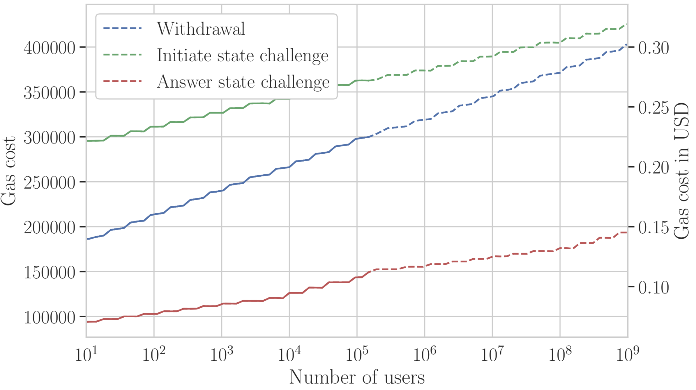

# Scaling Costs 📈

Scaling? Yes, towards thousands, ehm, hundred thou.., ehmm, Billions! We have tested our current commit-chain implementation with up to 100'000 client accounts, and the costs grow such that one commit-chain can support more than 1 Billion users 😊 - no matter how many transactions are done on the commit-chain.

Moreover, clients are *light by nature* and have only a few kb of storage and bandwidth requirements. Note, however, that clients are required to come online once in a round (every 36h) to audit their state. We plan to relax this requirements with watchtowers.

Now, please enjoy the following graph that shows on the x-axis up to 1 Billion users, and on the y-axis the blockchain costs for withdrawal (exit) and disputes with the operator.

More detailed and finer granular cost analysis can be found in the following table.

|                              | NOCUST Costs                                      | Cost Growth                                |
| ---------------------------- | ------------------------------------------------- | ------------------------------------------ |
| Checkpoint Notarization      | 80k gas                                           | Constant                                   |
| Deposit                      | 135k gas                                          | Constant                                   |
| Withdraw Initiation          | 150k gas, <400k gas @ 1 Billion users             | O(log(n_users) + log(n_supported_tokens))) |
| Dispute Initiation           | 220k gas, <450k gas @ 1Billion users              | O(log(n_users) + log(n_supported_tokens))) |
| Dispute Answer               | 250k gas, ~<200k gas @ 1Billion users             | O(log(n_users) + log(n_supported_tokens))) |
| Operator Storage             | All client accounts                               | O(n_users)                                 |
| Operator Bandwidth           | All active client accounts                        | O(n_users)                                 |
| Client Storage               | 312 bytes per transfer in the last 2 rounds + 1kb | Constant                                   |
| Client Verification          | Transfer signatures + one merkle proof per round  | Constant                                   |
| Client Bandwidth             | Own transactions only                             | Constant                                   |
| Fair Mass Exit               | Yes                                               |                                            |
| Delayed Transaction Finality | Yes, within 72 hours                              | Free                                       |
| Instant Transaction Finality | Yes, insurance capital                            | Depending on client need                   |
| Token Support                | ETH, ERC20                                        |                                            |